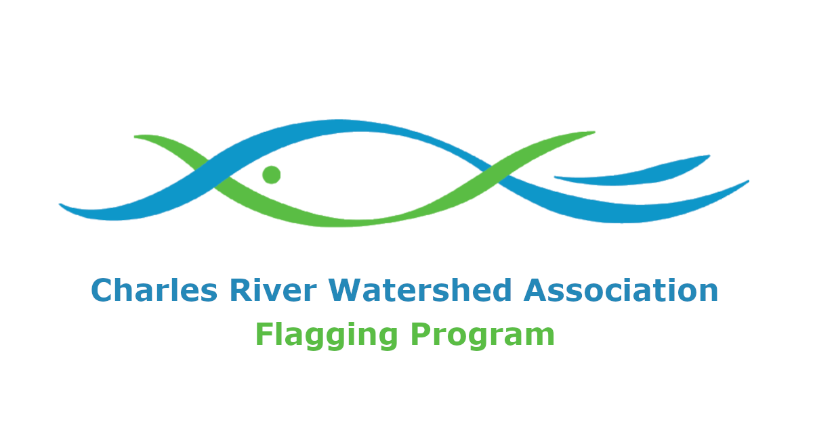

# Flagging Website

**Our website is live at: [https://crwa-flagging.herokuapp.com/](https://crwa-flagging.herokuapp.com/)**

## Overview

This is the code base for the [Charles River Watershed Association's](https://crwa.org/) ("CRWA") flagging website. The flagging website hosts an interface for the CRWA's staff to monitor the outputs of a predictive model that determines whether it is reasonably safe to swim or boat in the Charles River.

This code base is built in Python 3.7+ and utilizes the Flask library heavily. The website can be run locally in development mode, and it can be deployed to Heroku using Gunicorn.

## For Developers and Maintainers

**[Read our documentation here.](https://codeforboston.github.io/flagging/)** Our documentation contains information on everything related to the website, including [first time setup](https://codeforboston.github.io/flagging/setup/).

## Deploy to Heroku

**For true production / the CRWA:** Make sure `USE_MOCK_DATA` is set to `false`, then fill out all the Twitter and HOBOlink credentials.

**For demo purposes / general public:** Set `USE_MOCK_DATA` to `true` to run a version of this website in production using demo data.

## Credits

This website was built by volunteers at [Code for Boston](https://www.codeforboston.org/) in collaboration with the Charles River Watershed Association.
