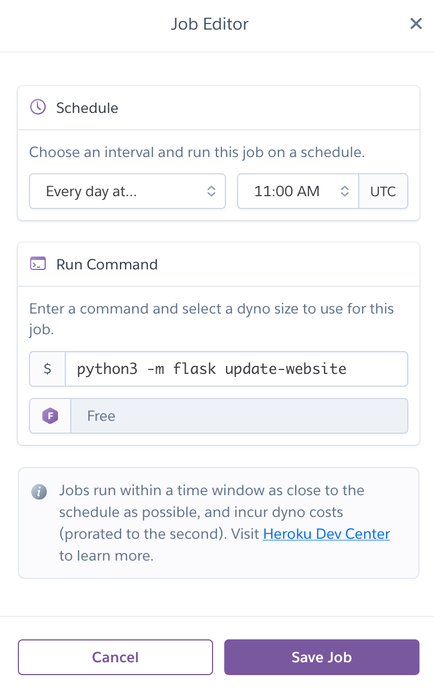

# Remote Deployment

???+ warning
    **This guide is outdated now that one-click deployment is available!**

???+ warning
    This guide is missing the Redis caching setup, and may miss other things as we build out.

The following tools are required to deploy the website:

- [Heroku CLI](https://devcenter.heroku.com/articles/heroku-cli)
- [Git](https://git-scm.com/book/en/v2/Getting-Started-Installing-Git)

Additionally, you will have to have set up the website locally to deploy to Heroku, notably including setting up the Postgres database.

???+ tip
    Read the [setup guide](../setup) to learn how to run the website locally.

## First Time Deployment

???+ note
    In this section, the project name is assumed to be `crwa-flagging`. If you are deploying to another URL, such as `crwa-flagging-staging` or a personal domain, then replace each reference to `crwa-flagging` with that.

If you've never deployed the app from your computer, follow these instructions.

1. If you have not already done so, follow the [setup guide](../setup). The following should now be true:

  - Your terminal is pointed to the root directory of the project `/flagging`.
  - You should have the HOBOlink credentials ready in a `.env` file.
  - The Postgres database should be set up and up-to-date locally.
  - Your Heroku account needs to be "verified," which means it needs to have a valid credit card registered to it. Registering a credit card does not incur any charges on its own. See [here](https://devcenter.heroku.com/categories/billing) for Heroku's billing page for more information.

???+ tip
    If you are especially weary of cloud costs, you can plug a prepaid credit card in with a small nominal amount for the balance. See [here](https://help.heroku.com/U32408KR/does-heroku-support-pre-paid-credit-cards-for-billing-and-account-verification) for more.

2. Via the command line: login to Heroku, and add Heroku as a remote repo using Heroku's CLI:

```shell
heroku login
heroku git:remote -a crwa-flagging
```

3. Add the vault password as an environment variable to Heroku.

```shell
heroku config:set VAULT_PASSWORD=vault_password_goes_here -a crwa-flagging
```

4. You need to setup the `FLASK_ENV` and `FLASK_APP` environment variables. These are mainly used for the scheduler and other potential add-ons.

```shell
heroku config:set FLASK_ENV=production -a crwa-flagging
heroku config:set FLASK_APP="flagging_site:create_app" -a crwa-flagging
```

5. Add a `BASIC_AUTH_USERNAME` and `BASIC_AUTH_PASSWORD` for the admin panel. The username can be whatever you want; e.g. `admin` does the trick. The password should be hard to guess.

```shell
heroku config:set BASIC_AUTH_USERNAME=admin -a crwa-flagging
heroku config:set BASIC_AUTH_PASSWORD=admin_password_goes_here -a crwa-flagging
```

???+ danger
    The password should be _unique_ to this platform, not a universal password you use for everything. The password is _not_ encrypted when stoerd, and it is visible to anyone who has access to the Heroku dashboard.

6. Add some Heroku add-ons.

```shell
heroku addons:create scheduler -a crwa-flagging
heroku addons:create heroku-postgresql -a crwa-flagging
```

???+ success
    Pay attention to the last line of output: 

    ```
    Creating heroku-postgresql on ⬢ crwa-flagging... free
    Database has been created and is available
     ! This database is empty. If upgrading, you can transfer
     ! data from another database with pg:copy
    Created postgresql-ukulele-12345 as DATABASE_URL
    ```
    
    In the above case, `postgresql-ukulele-12345` is the "name" of the PostgreSQL add-on's dyno. We will be using this name in the next step.


7. Push your local copy of the flagging database to the cloud. In the following command, replace `postgresql-ukulele-12345` with whatever the name of your PostgreSQL dyno is, which should have output from the previous step.

```shell
heroku pg:push flagging postgresql-ukulele-12345 -a crwa-flagging
```

???+ note
    The above command assumes that your local Postgres database is up-to-date.

8. Deploy the app.

```shell
git push heroku master
```

9. Now try the following:

```shell
heroku logs --tail -a crwa-flagging
```

10. If everything worked out, you should see the following at or near the bottom of the log:

```
2020-06-13T23:17:54.000000+00:00 app[api]: Build succeeded
```

???+ note
    If you see instead see something like `[...] State changed from starting to crashed`, then read the rest of the output to see what happened. The most common error when deploying to production will be a `RuntimeError: Unable to load the vault; bad password provided` which is self-explanatory. Update the password, and the website will automatically attempt to redeploy. If you don't see that error, then try to self-diagnose.

11. Go see the website for yourself!

12. You are still not done; you need to do one more step, which is to set up the task scheduler. Run the following command:

```shell
heroku addons:open scheduler -a crwa-flagging
```

13. The above command should open up a new window in your browser that lets you add a command that runs on a schedule. That command you set should be `python3 -m flask update-website`, and you should run it once a day at 11:00 AM UTC:



???+ tip
    If you want to have the website update more than once a day, it's probably better to run multiple scheduled jobs that run the same command on 24 hour intervals than it is to run a single scheduled job on hourly intervals.

???+ note
    The `update-website` command sends out a Tweet as well as re-running the predictive model. You can make the scheduled task only update the website without sending a tweet by replacing `update-website` with `update-db`.

## Subsequent Deployments

1. Heroku doesn't allow you to redeploy the website unless you create a new commit. Add some updates if you need to with `git add .` then `git commit -m "describe your changes here"`.

???+ note
    In the _very_ rare case you simply need to redeploy without making any changes to the site, in lieu of the above, simply do `git commit --allow-empty -m "redeploy"`.

2. Once you have done that, Heroku will redeploy the site when you merge your working branch:

```shell
git push heroku master
```

???+ tip
    If you are having any issues here related to merge conflicts, instead of deleting everything and starting over, try to pull the data from the `heroku` branch in and merge it into your local branch.
    
    ```shell
    git fetch heroku
    git pull heroku master
    ```

3. If you make any changes that affect the database, you should create the database locally, and then push it to the cloud, similar to the step above where we push the database for the first time. Note that updating the database this way requires that you reset it first.

```shell
heroku pg:reset -a crwa-flagging
heroku pg:push flagging postgresql-ukulele-12345 -a crwa-flagging
```

## Staging and Production Split

It is recommended, though not required, that you have both "staging" and "production" environments for the website (see [here](https://en.wikipedia.org/wiki/Deployment_environment#Staging) for an explanation), and furthermore it is recommended you deploy to staging and play around with the website to see if it looks right before you ever deploy to production.

Managing effectively two separate Heroku apps from a single repository requires a bit of knowledge about how git works. Basically what you're doing is connecting to two separate remote git repositories. The default remote repo is called `heroku` and it was created by Heroku's CLI. But since you now have two Heroku remote repositories, the Heroku CLI doesn't know what it's supposed to name the 2nd one. So you have to manually name it using git.

1. Run the following command to create a staging environment if it does not already exist.

```shell
heroku create crwa-flagging-staging
```

2. Once it exists, add the staging environment as a remote; check to make sure all the remotes look right. The `heroku` remote should correspond with the production environment, and the `staging` remote should correspond with the staging environment you just created.

```shell
git remote add staging https://git.heroku.com/crwa-flagging-staging.git
git remote -v
```

???+ success
    The above command should output something like this:
  
    ```
    heroku  https://git.heroku.com/crwa-flagging.git (fetch)
    heroku  https://git.heroku.com/crwa-flagging.git (push)
    origin  https://github.com/YOUR_USERNAME_HERE/flagging.git (fetch)
    origin  https://github.com/YOUR_USERNAME_HERE/flagging.git (push)
    staging https://git.heroku.com/crwa-flagging-staging.git (fetch)
    staging https://git.heroku.com/crwa-flagging-staging.git (push)
    upstream        https://github.com/codeforboston/flagging.git (fetch)
    upstream        https://github.com/codeforboston/flagging.git (push)
    ```

3. Now all of your `heroku` commands are going to require specifying this new app instance, but the steps to deploy in staging are otherwise similar to the production deployment, with the exception of `git push heroku master`.

4. Deployment via git requires pushing to the new remote like so:

```
git push staging master
```

## Updating the database schema

We do not use Alembic or any other tools to handle database migrations. Our database is relatively simple and does not store information that cannot be trivially rewritten, so we can migrate to a new database schema by simply creating the new database locally and completely overwriting the database in production.

Here are the steps to do that:

1. Make your changes to the database schema, then initialize the database again.

```shell
flask create-db --overwrite
flask init-db
```

2. Reset the database. You'll be asked if you're sure you want to reset, and go through that prompt.

```shell
heroku pg:reset -a crwa-flagging
```

3. Now push the new database:

```shell
heroku pg:push flagging DATABASE -a crwa-flagging
```

???+ note
    Unless there's an emergency, it's recommended you do something like this either late at night, or even better when it's no longer boating season.
