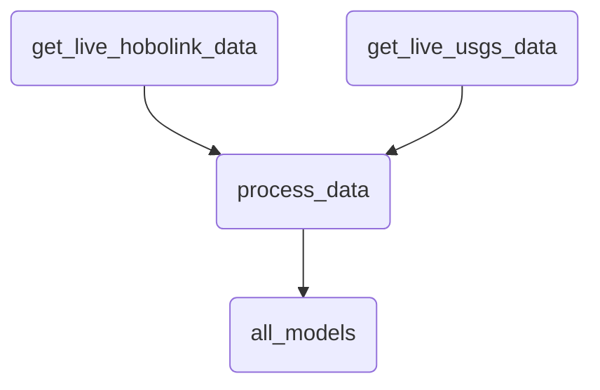

# Data

## High-Level Overview

Here is a "TLDR" of the data engineering for this website:

- To get data, we ping two different APIs, combine the responses from those API requests, do some processing and feature engineering of the data, and then run a predictive model on the processed data.

- To store the data and then later retrieve it for the front-end of the website, we use a PostgreSQL database.

- To actually run the functionality that gets data, processes it, and stores it. we run a [scheduled job](https://en.wikipedia.org/wiki/Job_scheduler) that runs the command `flask update-website` at a set time intervals.

## Database

### Setup the database

#### Locally (Development)

Make sure you follow the [setup guide](../setup) for local development.

When you run `run_unix_dev.sh` (OSX) or `run_windows_dev.bat`, it will run these commands for you:

- `flask create-db` - Creates the database.
- `flask init-db` - Creates the table schemas inside the database and populates them.

???+ tip
    You can access your local PostgreSQL instance using the command `psql`. Here are some helpful commands inside the PSQL terminal:
    
    * `\q`: Quit.
    * `\l`: Show what databases are available.
    * `\c [database_name]`: Connect to a database.
    * `\du`: Show what users are available.
    * `\dt`: Show what tables are available.


#### On Heroku (Staging / Production)

If you one-click deploy using `app.json` (official docs [here](https://devcenter.heroku.com/articles/app-json-schema)), it will setup the Postgres database automatically; the address will be available in the environment variable `DATABASE_URL`. After setting up the instance, it will automatically run the command `flask init-db`.

Alternatively, you can set up the Postgres database manually:

- Add the [Heroku Postgres database add-on](https://elements.heroku.com/addons/heroku-postgresql) to the app.
- Set the env variable `HEROKU_APP` to be your Heroku app instance name, then set up the database in one of two ways from your command line:
  - Fully remote: `heroku run --app=$ flask init-db`
  - Push from local: `heroku pg:push DATABASE flagging`

### Update the database

The database is updated with the commands `flask update-db` and `flask update-website`. The latter command runs `update-db` for you, then sends a Tweet of the flag statuses after updating.

???+ info
    When deployed via Heroku, the [Heroku scheduler](https://devcenter.heroku.com/articles/scheduler) is what runs these commands automatically. You need to set this up yourself manually via the dashboard.

The database tables are updated in this order: raw data is collected, then this data is processed, and finally the models are run and the outputs are stored:



## Data Gathering & Processing

### Sources

There are two sources of data for our website:

1. An API hosted by the USGS National Water Information System API that's hooked up to a Waltham based stream gauge (herein **"USGS" data**);
2. An API for a HOBOlink RX3000 Remote Monitoring Station device stationed on the Charles River (herein **"HOBOlink" data**).

#### USGS 

The code for retrieving and processing the HOBOlink data is in `flagging_site/data/usgs.py`.

The USGS API very is straightforward. It's a very typical REST API. Our preprocessing of the USGS API consists of parsing the response into a Pandas dataframe.

The data returned by the USGS API is in 15 minute increments, and it measures the stream flow (cubic feet per second) of the Charles River out in Waltham.

#### HOBOlink

The code for retrieving and processing the HOBOlink data is in `flagging_site/data/hobolink.py`.

The HOBOlink device captures various information about the Charles River at the location it's stationed:

- Air temperature
- Water temperature
- Wind speed
- Photosynthetically active radiation (i.e. sunlight)
- Rainfall

The HOBOlink data is accessed through a REST API using the following environment variables for authorization:
 
- `HOBOLINK_PASSWORD`
- `HOBOLINK_USERNAME`
- `HOBOLINK_TOKEN`

The data actually returned by the API is a combination of a YAML file with a CSV below it. We just use the CSV part. We then do the following to preprocess the CSV:

1. Remove all timestamps ending `:05`, `:15`, `:25`, `:35`, `:45`, and `:55`. These only contain battery information, not weather information. The final dataframe returned is ultimately in 10 minute increments.
2. Make the timestamp consistently report eastern standard times. Note that the time column does not have a consistent name-- sometimes it's `Time, GMT-04:00`, sometimes it's `Time, GMT-05:00`, depending on daylight savings time.
3. We consolidate duplicative columns. The HOBOlink API has a weird issue where sometimes it splits columns of data with the same name, seemingly at random. This issue causes serious data issues if untreated (at one point, it caused our model to fail to update for a couple days), so our function cleans the data.

As you can see from the above, the HOBOlink API is a bit finicky for whatever reason, but we have a good data processing solution for these problems.

???+ note
    Our code is unit-tested against real HOBOlink outputs we've previously received that displayed weird data and caused problems for us:
    
    - `test_case_01_input.txt`: Duplicative columns and `Time, GMT-04:00`.
    - `test_case_02_input.txt`: `Time, GMT-05:00`.
    
    The file `tests/test_data.py` runs the raw inputs and makes sure it processes the same outputs.
    
    If you in the future run into another HOBOlink output that causes errors, fix it then add the HOBOlink response to the test cases. You can generate such test cases by entering the `flask shell` and then running:
    
    ```python
    res = request_to_hobolink()
    s = res.text
    open('test_case.txt', 'w+').write(s)
    ```
    
    Then `exit()` after everything looks fine.

???+ tip
    You can manually download the latest raw data from this device [here](https://www.hobolink.com/p/0cdac4a6910cef5a8883deb005d73ae1). If you want some preprocessed data that implements the above modifications to the output, there is a better way to get that data explained in the shell guide.

### Combining data and predicting

Information on preprocessing for prediction, and the predictive models themselves, are covered [here](./predictive_models).

## Data and the website

### The `db` object

The database connection is managed by an object inside `database.py`, called `db`, which is a "SQLAlchemy" instance.

???+ note
    SQLAlchemy is a Python library used to connect Python code to a SQL database. It's a pretty advanced framework with lots of ways to use it.
    
    We tried our best to only use the more advanced features of SQLAlchemy, e.g. the "ORM," for connecting the front-end to the database. We tried to avoid using these advanced features of SQLAlchemy when connecting the predictive model to the database.

The `db` object does a lot for us. We use it in two main ways: 

1. to connect to the database, read from it, and write to it. As of writing we use the Pandas function `pd.read_sql()`, passing in the `db` object, to read the `model_outputs` data.
2. to create database "models" (database models are models of the table schemas; these are not the same as the predictive models). These models are stored inside of `boathouses.py` and `live_website_options.py`, and are used extensively in the front-end.

### API and Front-end

The `Boathouse` and `LiveWebsiteOptions` objects interface with both the front-end code and the REST API in various ways. See the code base for more. For more information on the front-end, see [here](./frontend).
