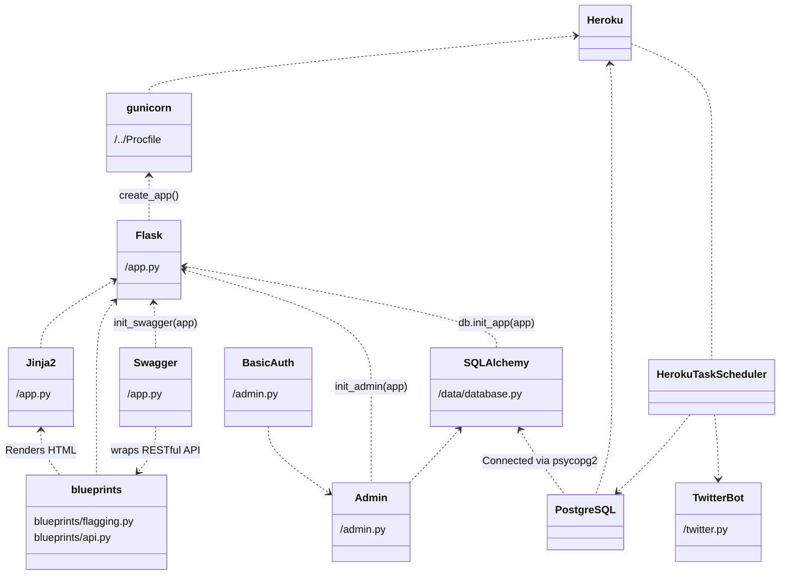

# Development - Overview

The Development guide is aimed at users who wish to understand the code base and make changes to it if need be.

This overview page describes at a high-level what the website's infrastructure is, how it all relates, and why those things are in the app.

!!! tip
    Make sure to go through the [setup guide](../setup) before doing anything in the development guide.

## Dependency Diagram

