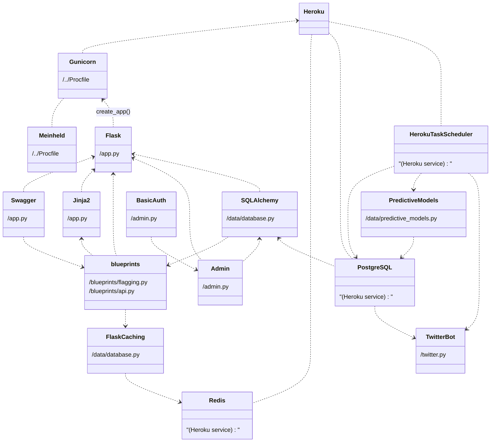

# Development - Overview

???+ note
    **(Nov 2024 update)** We cannot guarantee that anything in the Development section is fully up-to-date. This should be considered a historic document. The best explanation for how the code works will ultimately be the code itself.

The Development guide is aimed at users who wish to understand the code base and make changes to it if need be.

This overview page describes at a high-level what the website's infrastructure is, how it all relates, and why those things are in the app.

## Website System Design



## Overview of repo

Sometimes it can be a little confusing and overwhelming seeing all the files strewn about in the root directory of the repo. Here are all the files (as of writing) and why they're there.

```
.
├── .flaskenv
├── .python_version
├── .github
│   └── workflows
│       └── tests.yml
├── .gitignore
├── app.json
├── docs
│   ├── README.md
│   ├── mkdocs.yml
│   ├── site
│   └── src
├── app
│   └── ...
├── LICENSE
├── Procfile
├── pytest.ini
├── README.md
├── Dockerfile
├── docker-compose.yml
├── requirements.in
│   └── ...
├── requirements.txt
├── runtime.txt
└── tests
     └── ...
```

- `.python_version`: Both Heroku and `uv` use this to determine the Python version.
- `.flaskenv`: Helper file for Flask local deployment. ([more info](https://flask.palletsprojects.com/en/1.1.x/cli/#environment-variables-from-dotenv))
- `.github/workflows/tests.yml`: This file is handled by Github Actions. It runs the unit-tests. ([more info](https://docs.github.com/en/actions/learn-github-actions))
- `.gitignore`: Tells git what files to ignore. ([more info](https://git-scm.com/docs/gitignore))
- `app.json`: Used by Heroku to set up one-click deployment for the app. ([more info](https://devcenter.heroku.com/articles/app-json-schema))
- `docs`: Contains source code for the documentation. Rendered with Mkdocs. ([more info](https://www.mkdocs.org/))
- `app`: The actual code base for the flagging website.
- `LICENSE`: License that governs the project's code base.
- `Procfile`: Heroku uses this to know what to run on the deployed instance. ([more info](https://devcenter.heroku.com/articles/procfile))
- `pytest.ini`: Unit-testing configuration. When you run `python -m pytest ./tests`, this file is read in. We need it for some Pytest extensions, and to define a label we use to skip tests that require credentials. ([more info](https://docs.pytest.org/en/stable/customize.html))
- `README.md`: Self-explanatory.
- `Dockerfile`: Used to build a Docker image.
- `docker-compose.yml`: Determines how the code runs with the `docker compose` commands.
- `requirements.in`: This is the pre-compiled version of our dependencies. Use `uv pip compile requirements.in -o requirements.txt` to generate compiled dependencies.
- `requirements.txt`: The frozen dependencies used by the webserver. Heroku also requires a `requirements.txt` in the root of the repo.
